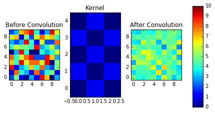
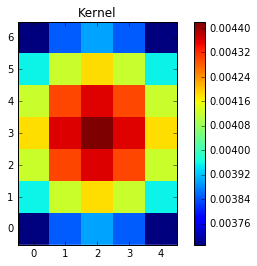
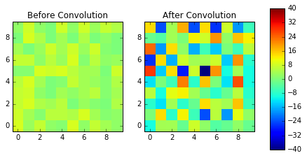
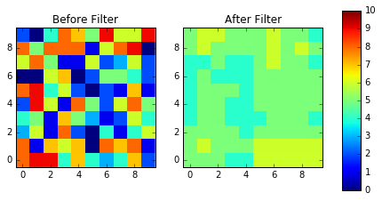
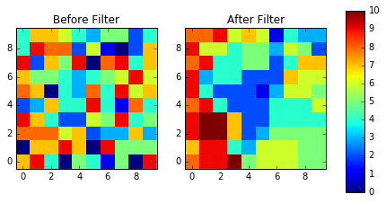
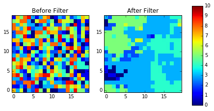

images.imfilter
===============

Notes
-----

Astropy convolution offers two convolution options, ``convolve()`` is
better for small kernels, and ``convolve_fft()`` is better for larger
kernels, please see the `Astropy convolution doc
page <http://docs.astropy.org/en/stable/convolution/>`__ and `Astropy
Convolution How
to <http://docs.astropy.org/en/stable/convolution/using.html>`__ for
more details. For this notebook, we will use ``convolve``. Check out the
list of kernels and filters avaialble for
`Astropy <http://docs.astropy.org/en/stable/convolution/#module-astropy.convolution>`__,
and `Scipy <http://docs.scipy.org/doc/scipy/reference/ndimage.html>`__

Although ``astropy.convolution`` is built on ``scipy``, it offers
several advantages: \* can handle NaN values \* improved options for
boundaries \* provided built in kernels

So when possible, we will be using ``astropy.convolution`` functions in
this notebook.

**Important Note**

You can select from the following boundary rules in
``astropy.convolution``: \* none \* fill \* wrap \* extend

You can select from the following boundary rules in
``scipy.ndimage.convolution``: \* reflect \* constant \* nearest \*
mirror \* wrap

Contents:

-  `boxcar <#boxcar>`__
-  `convolve <#boxcar>`__
-  `gauss <#convolve>`__
-  `gradient <#gradient>`__
-  `laplace <#laplace>`__
-  `median <#median>`__
-  `mode <#mode>`__

boxcar
------

\*\* Please review the `Notes <#notes>`__ section above before running
any examples in this notebook \*\*

The boxcar convolution does a boxcar smoothing with a given box size,
and applies this running average to an array. Here we show a 2-D example
using ``Box2DKernel``, which is convient for square box sizes.

.. code:: python

    from astropy.io import fits
    import numpy as np
    from astropy.convolution import convolve as ap_convolve
    from scipy.ndimage import convolve as sp_convolve
    
    import matplotlib.pyplot as plt
    %matplotlib inline
    
    from astropy.convolution import Box2DKernel

.. code:: python

    # create test array
    my_arr = np.random.randint(0,10,(10,10))
    # setup our kernel
    box_kernel = Box2DKernel(3)
    # perform convolution
    result = ap_convolve(my_arr, box_kernel, normalize_kernel=True)

.. code:: python

    fig, axes = plt.subplots(nrows=1, ncols=3)
    a = axes[0].imshow(my_arr,interpolation='none', origin='lower',vmin=0, vmax=10)
    axes[0].set_title('Before Convolution')
    a = axes[1].imshow(box_kernel,interpolation='none', origin='lower',vmin=0, vmax=10)
    axes[1].set_title('Kernel')
    a = axes[2].imshow(result,interpolation='none', origin='lower',vmin=0, vmax=10)
    axes[2].set_title('After Convolution')
    
    fig.subplots_adjust(right = 0.8,left=0)
    cbar_ax = fig.add_axes([0.85, 0.15, 0.05, 0.7])
    fig.colorbar(a, cax=cbar_ax)
    plt.show()

.. image:: images.imfilter_files/images.imfilter_9_0.png

Add example of rectangular boxcar / ask astropy why they didn't include
this...

convolve
--------

\*\* Please review the `Notes <#notes>`__ section above before running
any examples in this notebook \*\*

The convolve task allows you to convolve your data array with a kernel
of your own creation. Here we show a simple example of a rectangular
kernel applied to a 10 by 10 array using the
``astropy.convolution.convolve`` function

.. code:: python

    from astropy.io import fits
    import numpy as np
    from astropy.convolution import convolve as ap_convolve
    from scipy.ndimage import convolve as sp_convolve
    
    import matplotlib.pyplot as plt
    %matplotlib inline

.. code:: python

    # create test array
    my_arr = np.random.randint(0,10,(10,10))
    # setup our custom kernel
    my_kernel = [[0,1,0],[1,0,1],[0,1,0],[1,0,1],[0,1,0]]
    # perform convolution
    result = ap_convolve(my_arr, my_kernel, normalize_kernel=True, boundary='wrap')

.. code:: python

    fig, axes = plt.subplots(nrows=1, ncols=3)
    a = axes[0].imshow(my_arr,interpolation='none', origin='lower',vmin=0, vmax=10)
    axes[0].set_title('Before Convolution')
    a = axes[1].imshow(my_kernel,interpolation='none', origin='lower',vmin=0, vmax=10)
    axes[1].set_title('Kernel')
    a = axes[2].imshow(result,interpolation='none', origin='lower',vmin=0, vmax=10)
    axes[2].set_title('After Convolution')
    
    fig.subplots_adjust(right = 0.8,left=0)
    cbar_ax = fig.add_axes([0.85, 0.15, 0.05, 0.7])
    fig.colorbar(a, cax=cbar_ax)
    plt.show()

convolve
--------

\*\* Please review the `Notes <#notes>`__ section above before running
any examples in this notebook \*\*

Here is an example using masking with ``astropy.convolve``

.. code:: python

    from astropy.io import fits
    import numpy as np
    from astropy.convolution import convolve as ap_convolve
    from scipy.ndimage import convolve as sp_convolve
    
    import matplotlib.pyplot as plt
    %matplotlib inline

.. code:: python

    # create test array
    my_arr = np.random.random_sample((10,10)) * 10
    my_arr[5,5] = np.nan
    my_arr[2,8] = np.nan
    # setup our custom kernel
    my_kernel = [[0,1,0],[1,0,1],[0,1,0],[1,0,1],[0,1,0]]
    # perform convolution
    result = ap_convolve(my_arr, my_kernel, normalize_kernel=True, boundary='wrap')

.. code:: python

    fig, axes = plt.subplots(nrows=1, ncols=3)
    a = axes[0].imshow(my_arr,interpolation='none', origin='lower',vmin=0, vmax=10)
    axes[0].set_title('Before Convolution')
    a = axes[1].imshow(my_kernel,interpolation='none', origin='lower',vmin=0, vmax=10)
    axes[1].set_title('Kernel')
    a = axes[2].imshow(result,interpolation='none', origin='lower',vmin=0, vmax=10)
    axes[2].set_title('After Convolution')
    
    fig.subplots_adjust(right = 0.8,left=0)
    cbar_ax = fig.add_axes([0.85, 0.15, 0.05, 0.7])
    fig.colorbar(a, cax=cbar_ax)
    plt.show()

.. image:: images.imfilter_files/images.imfilter_21_0.png

Here is an example using masking with ``scipy.convolve``

.. code:: python

    # create test array
    my_arr = np.random.random_sample((10,10)) * 10
    my_arr[5,5] = np.nan
    my_arr[2,8] = np.nan
    # setup our custom kernel
    my_kernel = np.array([[0,1,0],[1,0,1],[0,1,0],[1,0,1],[0,1,0]]) * (1/7.0)
    # perform convolution
    result = sp_convolve(my_arr, my_kernel, mode='wrap')

.. code:: python

    fig, axes = plt.subplots(nrows=1, ncols=3)
    a = axes[0].imshow(my_arr,interpolation='none', origin='lower',vmin=0, vmax=10)
    axes[0].set_title('Before Convolution')
    a = axes[1].imshow(my_kernel,interpolation='none', origin='lower',vmin=0, vmax=10)
    axes[1].set_title('Kernel')
    a = axes[2].imshow(result,interpolation='none', origin='lower',vmin=0, vmax=10)
    axes[2].set_title('After Convolution')
    
    fig.subplots_adjust(right = 0.8,left=0)
    cbar_ax = fig.add_axes([0.85, 0.15, 0.05, 0.7])
    fig.colorbar(a, cax=cbar_ax)
    plt.show()

.. image:: images.imfilter_files/images.imfilter_24_0.png

gauss
-----

\*\* Please review the `Notes <#notes>`__ section above before running
any examples in this notebook \*\*

The gaussian kernel convolution applies a gaussian function convolution
to your data array. The ``Gaussian2DKernel`` size is defined slightly
differently from the IRAF version:
http://docs.astropy.org/en/stable/api/astropy.convolution.Gaussian2DKernel.html#astropy.convolution.Gaussian2DKernel

.. code:: python

    from astropy.io import fits
    import numpy as np
    from astropy.convolution import convolve as ap_convolve
    from scipy.ndimage import convolve as sp_convolve
    
    import matplotlib.pyplot as plt
    %matplotlib inline
    
    from astropy.convolution import Gaussian2DKernel

.. code:: python

    # create test array
    my_arr = np.random.randint(0,10,(30,30))
    # setup our kernel, with 6 sigma and a 3 in x by 5 in y size
    gauss_kernel = Gaussian2DKernel(6, x_size=5, y_size=7)
    # perform convolution
    result = ap_convolve(my_arr, gauss_kernel, normalize_kernel=True)
    
    gauss_kernel

.. parsed-literal::

    <astropy.convolution.kernels.Gaussian2DKernel at 0x11d3d3a10>

.. code:: python

    plt.imshow(gauss_kernel, interpolation='none', origin='lower')
    plt.title('Kernel')
    plt.colorbar()
    plt.show()

.. code:: python

    fig, axes = plt.subplots(nrows=1, ncols=2)
    a = axes[0].imshow(my_arr,interpolation='none', origin='lower',vmin=0, vmax=10)
    axes[0].set_title('Before Convolution')
    a = axes[1].imshow(result,interpolation='none', origin='lower',vmin=0, vmax=10)
    axes[1].set_title('After Convolution')
    
    fig.subplots_adjust(right = 0.8,left=0)
    cbar_ax = fig.add_axes([0.85, 0.15, 0.05, 0.7])
    fig.colorbar(a, cax=cbar_ax)
    plt.show()

.. image:: images.imfilter_files/images.imfilter_31_0.png

gradient
--------

\*\* Please review the `Notes <#notes>`__ section above before running
any examples in this notebook \*\*

.. code:: python

    from astropy.io import fits
    import numpy as np
    from astropy.convolution import convolve as ap_convolve
    from scipy.ndimage import convolve as sp_convolve
    
    import matplotlib.pyplot as plt
    %matplotlib inline
    
    from scipy.ndimage.filters import generic_gradient_magnitude
    from scipy.misc import derivative
    from scipy import exp2

.. code:: python

    footprint = np.array([[1, 1, 1], [1, 1, 1], [1, 1, 1]])
    out = generic_gradient_magnitude(footprint,????)

.. parsed-literal::

    1.99999999995

::

    ---------------------------------------------------------------------------

    TypeError                                 Traceback (most recent call last)

    <ipython-input-56-4de9aeb9411c> in <module>()
          2 der = derivative(f,1.0,dx=1e-6)
          3 print der
    ----> 4 out = generic_gradient_magnitude(footprint,f)
          5 out

    /Users/ogaz/miniconda2/envs/irafdev/lib/python2.7/site-packages/scipy/ndimage/filters.pyc in generic_gradient_magnitude(input, derivative, output, mode, cval, extra_arguments, extra_keywords)
        534     if len(axes) > 0:
        535         derivative(input, axes[0], output, mode, cval,
    --> 536                    *extra_arguments, **extra_keywords)
        537         numpy.multiply(output, output, output)
        538         for ii in range(1, len(axes)):

    TypeError: f() takes exactly 1 argument (5 given)

laplace
-------

\*\* Please review the `Notes <#notes>`__ section above before running
any examples in this notebook \*\*

The laplace task runs a image convolution using a laplacian filter with
a subset of footprints. For the ``scipy.ndimage.filter.laplace``
function we will be using, you can feed any footprint in as an array to
create your kernel.

.. code:: python

    from astropy.io import fits
    import numpy as np
    from astropy.convolution import convolve as ap_convolve
    from scipy.ndimage import convolve as sp_convolve
    
    import matplotlib.pyplot as plt
    %matplotlib inline
    
    from scipy.ndimage import laplace

.. code:: python

    # create test array
    my_arr = np.random.randint(0,10,(10,10))
    # setup our laplace kernel with a target footprint (diagonals in IRAF)
    footprint = np.array([[0, 1, 0], [1, 1, 1], [0, 1, 0]])
    laplace_kernel = laplace(footprint)
    # perform scipy convolution
    result = sp_convolve(my_arr, laplace_kernel)

.. code:: python

    plt.imshow(laplace_kernel, interpolation='none', origin='lower')
    plt.title('Kernel')
    plt.colorbar()
    plt.show()

.. image:: images.imfilter_files/images.imfilter_42_0.png

.. code:: python

    fig, axes = plt.subplots(nrows=1, ncols=2)
    a = axes[0].imshow(my_arr,interpolation='none', origin='lower',vmin=-40, vmax=40)
    axes[0].set_title('Before Convolution')
    a = axes[1].imshow(result,interpolation='none', origin='lower',vmin=-40, vmax=40)
    axes[1].set_title('After Convolution')
    
    fig.subplots_adjust(right = 0.8,left=0)
    cbar_ax = fig.add_axes([0.85, 0.15, 0.05, 0.7])
    fig.colorbar(a, cax=cbar_ax)
    plt.show()

median / rmedian
----------------

\*\* Please review the `Notes <#notes>`__ section above before running
any examples in this notebook \*\*

Apply a median filter to your data array. We will use the
``scipy.ndimage.filters.median_filter`` function.

.. code:: python

    from astropy.io import fits
    import numpy as np
    from astropy.convolution import convolve as ap_convolve
    from scipy.ndimage import convolve as sp_convolve
    
    import matplotlib.pyplot as plt
    %matplotlib inline
    
    from scipy.ndimage.filters import median_filter

.. code:: python

    # create test array
    my_arr = np.random.randint(0,10,(10,10))
    # apply median filter
    filtered = median_filter(my_arr,size=(3,4))

.. code:: python

    fig, axes = plt.subplots(nrows=1, ncols=2)
    a = axes[0].imshow(my_arr,interpolation='none', origin='lower',vmin=0, vmax=10)
    axes[0].set_title('Before Filter')
    a = axes[1].imshow(filtered,interpolation='none', origin='lower',vmin=0, vmax=10)
    axes[1].set_title('After Filter')
    
    fig.subplots_adjust(right = 0.8,left=0)
    cbar_ax = fig.add_axes([0.85, 0.15, 0.05, 0.7])
    fig.colorbar(a, cax=cbar_ax)
    plt.show()

.. image:: images.imfilter_files/images.imfilter_49_0.png

For a ring median filter we can supply a more specific footprint to the
``median_filter`` function. You can easily generate this footprint using
the ``astroimtools`` library

.. code:: python

    from astroimtools import circular_annulus_footprint
    
    #depreciation warning, is fixed already in the dev version, not sure when this is getting pushed

.. parsed-literal::

    WARNING: AstropyDeprecationWarning: astropy.utils.compat.argparse is now deprecated - use the argparse module directly instead [astropy.utils.compat.argparse]

.. code:: python

    # create test array
    my_arr = np.random.randint(0,10,(10,10))
    # create annulus filter
    fp = circular_annulus_footprint(10, 12)
    # apply median filter
    filtered = median_filter(my_arr, footprint=fp)

.. code:: python

    fig, axes = plt.subplots(nrows=1, ncols=2)
    a = axes[0].imshow(my_arr,interpolation='none', origin='lower',vmin=0, vmax=10)
    axes[0].set_title('Before Filter')
    a = axes[1].imshow(filtered,interpolation='none', origin='lower',vmin=0, vmax=10)
    axes[1].set_title('After Filter')
    
    fig.subplots_adjust(right = 0.8,left=0)
    cbar_ax = fig.add_axes([0.85, 0.15, 0.05, 0.7])
    fig.colorbar(a, cax=cbar_ax)
    plt.show()

mode / rmode
------------

\*\* Please review the `Notes <#notes>`__ section above before running
any examples in this notebook \*\*

The mode calculation equation used in the mode and rmode IRAF tasks
(3.0\*median - 2.0\*mean) can be recreated using the
``scipy.ndimage.generic_filter`` function. \*\* explination for
approximation\*\*

.. code:: python

    from astropy.io import fits
    import numpy as np
    from astropy.convolution import convolve as ap_convolve
    from scipy.ndimage import convolve as sp_convolve
    
    import matplotlib.pyplot as plt
    %matplotlib inline
    
    from scipy.ndimage import generic_filter
    from astroimtools import circular_annulus_footprint

.. code:: python

    def mode_func(in_arr):
        f = 3.0*np.median(in_arr) - 2.0*np.mean(in_arr)
        return f

For a box footprint:

.. code:: python

    # create test array
    my_arr = np.random.randint(0,10,(10,10))
    # apply mode filter
    filtered = generic_filter(my_arr,mode_func,size=5)

.. code:: python

    fig, axes = plt.subplots(nrows=1, ncols=2)
    a = axes[0].imshow(my_arr,interpolation='none', origin='lower',vmin=0, vmax=10)
    axes[0].set_title('Before Filter')
    a = axes[1].imshow(filtered,interpolation='none', origin='lower',vmin=0, vmax=10)
    axes[1].set_title('After Filter')
    
    fig.subplots_adjust(right = 0.8,left=0)
    cbar_ax = fig.add_axes([0.85, 0.15, 0.05, 0.7])
    fig.colorbar(a, cax=cbar_ax)
    plt.show()

For a ring footprint:

.. code:: python

    # create test array
    my_arr = np.random.randint(0,10,(20,20))
    # create annulus filter
    fp = circular_annulus_footprint(5, 9)
    # apply mode filter
    filtered = generic_filter(my_arr,mode_func,footprint=fp)

.. code:: python

    fig, axes = plt.subplots(nrows=1, ncols=2)
    a = axes[0].imshow(my_arr,interpolation='none', origin='lower',vmin=0, vmax=10)
    axes[0].set_title('Before Filter')
    a = axes[1].imshow(filtered,interpolation='none', origin='lower',vmin=0, vmax=10)
    axes[1].set_title('After Filter')
    
    fig.subplots_adjust(right = 0.8,left=0)
    cbar_ax = fig.add_axes([0.85, 0.15, 0.05, 0.7])
    fig.colorbar(a, cax=cbar_ax)
    plt.show()

 ## Not Replacing

-  runmed - see **images.imutil.imsum**
-  fmode

 ### fmedian

runmed seems to be kind of complicated, should figure out if people ever
use this...

 ### to-do \* Go over plot examples (with Larry?) \* figure out gradient
usage \* figure out fmedian (is it used?)

